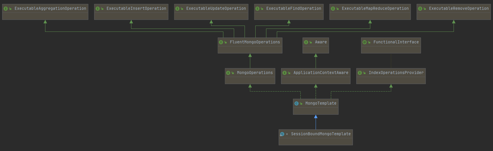

## MongoDB 

- [SpringBoot-MongoDB 官方文档](https://docs.spring.io/spring-data/mongodb/docs/3.1.2/reference/html/#introduction) 
- [基础教程](https://www.runoob.com/mongodb) 
- [整理的MongoDB详细文档](https://github.com/GitHubWxw/wxw-document/tree/master/%E5%90%8E%E7%AB%AF%E6%8A%80%E6%9C%AF/%E5%88%86%E5%B8%83%E5%BC%8F%E4%B8%AD%E9%97%B4%E4%BB%B6/%E7%BC%93%E5%AD%98/3_MongoDB/MongoDB%E5%9F%BA%E7%A1%80)  

## MongoDB 概述

### 继承关系简述

 

### 主流的实现方法

#### 1. MongoTemplate 或 MongoOperations 接口

#### 2. MongoClient

#### 3. MongoRepository

#### 4. @MogoId和@Document 注解