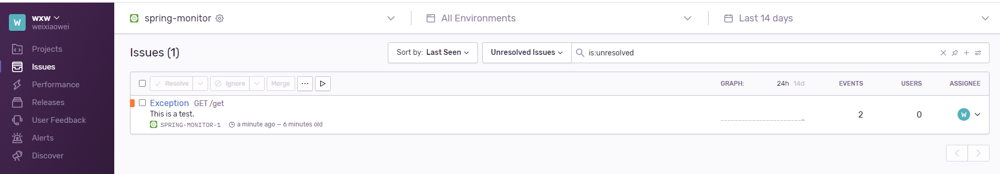

### 应用监控项目

### 1. 异常监控Sentry

Sentry是异常监控(error tracking)和告警平台，和普通日志比起来，异常日志相对少。Sentry可以独立部署，内部有各种优化(缓存/异步/限流/分组等)，保证高性能处理异常日志。
如果要做普通日志采集或者分析的话，ELK是不错选择，ELK可以分布式部署，根据你的容量可以按需扩容。

Senty是专门用来干异常日志监控的，它的核心就是围绕异常日志来建模和设计的，它有很多的异常日志监控特性，包括智能错误分析，归类汇总，自动分配告警到相关团队等等，这些虽然理论上ELK也能实现，但是实现成本比较高。

- 官网门户：https://docs.sentry.io/  

#### 1.1 账户

| 登录地址                                      | 用户名 | 密码  |
| --------------------------------------------- | ------ | ----- |
| https://sentry.io/organizations/wxw/projects/ | 邮箱   | 1***6 |

#### 1.2 监控到的异常任务

 

#### 1.3 异常事件分析

 