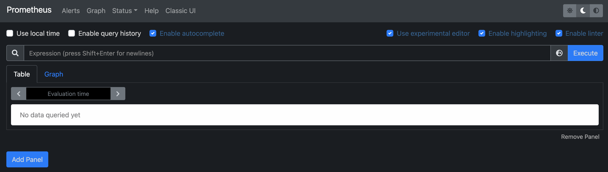
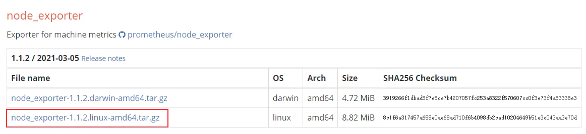
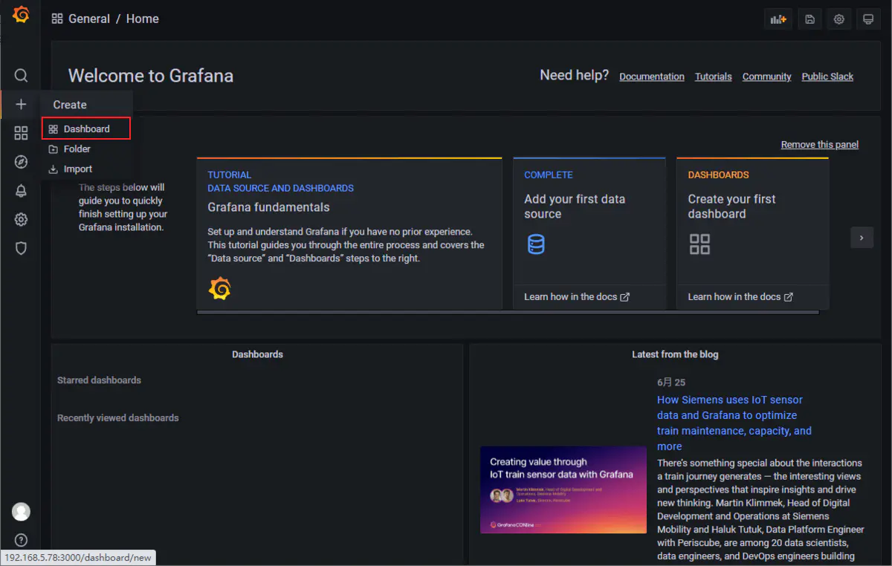
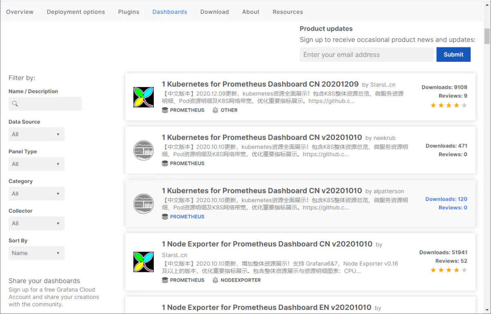
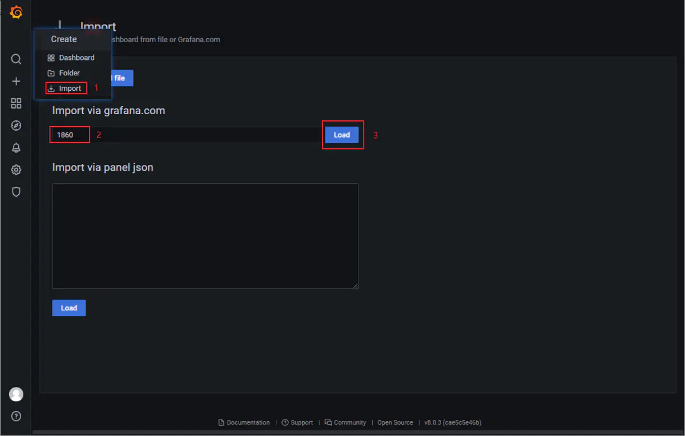
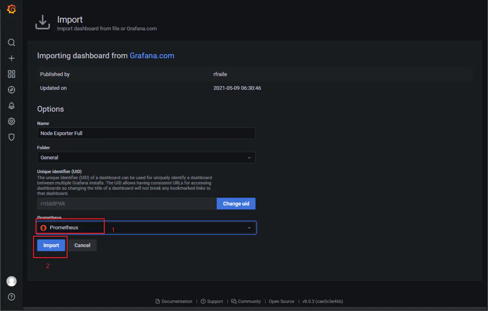
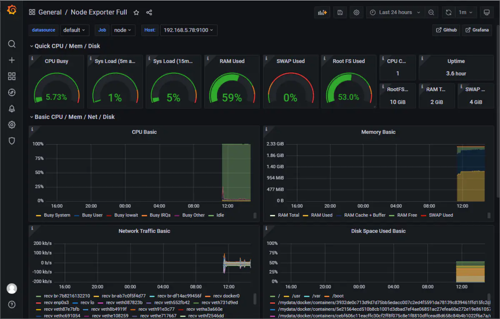
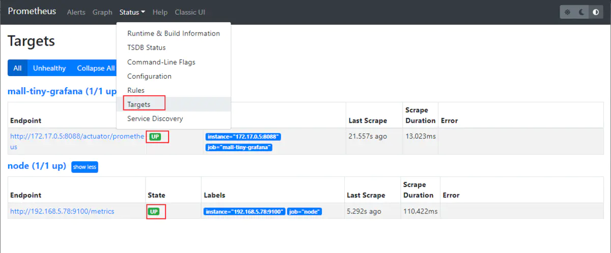
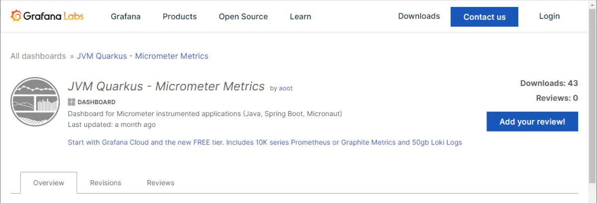
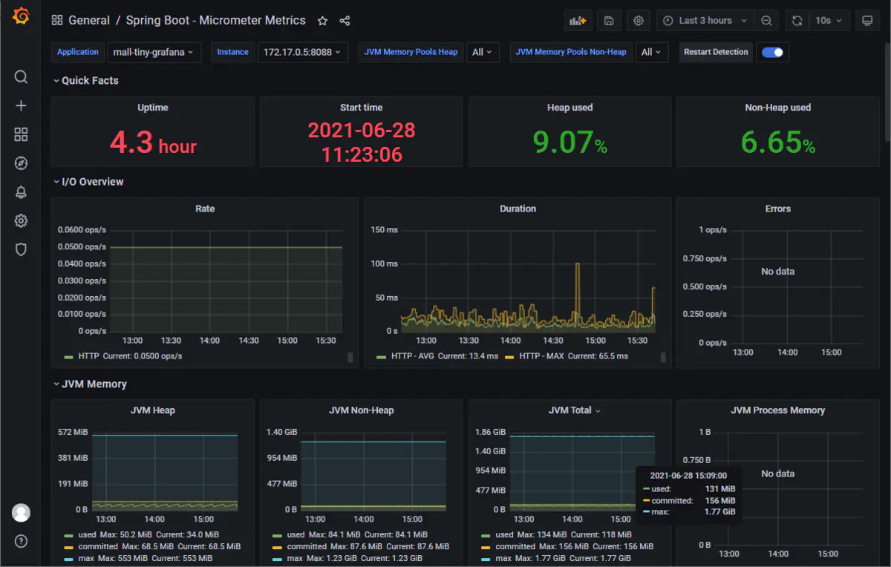

###  Prometheus + Grafana 监控

> Spring Boot Actuator+Prometheus + Grafana 监控

当面对一个复杂的系统时，我们往往需要监控工具来帮助我们解决一些性能问题。比如之前我们使用`SpringBoot Admin` （[访问地址](https://blog.csdn.net/qq_41893274/article/details/112135763)）来监控应用，从而获取到`SpringBoot Actuator`暴露的指标信息，这个方案可以实时监控并提供告警提醒功能，但不能记录历史数据，无法查看过去1小时或过去1天等运维情况。今天给大家介绍一个功能强大的监控工具Grafana，只要需要用到监控的地方，用它做可视化就对了！

本文介绍Prometheus + Grafana的方法监控Springboot 2.X，实现美观漂亮的数据可视化。


 

###  基础回顾

#### 1. Prometheus

Prometheus的基本原理是通过HTTP协议周期性抓取被监控组件的状态，任意组件只要提供对应的HTTP接口就可以接入监控。不需要任何SDK或者其他的集成过程。这样做非常适合做虚拟化环境监控系统，比如VM、Docker、Kubernetes等。输出被监控组件信息的HTTP接口被叫做exporter 。目前互联网公司常用的组件大部分都有exporter可以直接使用，比如Varnish、Haproxy、Nginx、MySQL、Linux系统信息(包括磁盘、内存、CPU、网络等等)。

#### 2. Grafana

Grafana是一款用Go语言开发的开源数据可视化工具，它是一款开源的数据可视化和分析工具，不管你的指标信息存储在哪里，你都可以用它来可视化这些数据。同时它还具有告警功能，当指标超出指定范围时会提醒你。

- 官网文档：https://grafana.com/docs/grafana/latest/installation/

#### 3. spring boot actuator 

spring boot actuator 可以监控和度量spring boot 应用程序

### 运行环境

使用Docker安装Grafana和Prometheus无疑是最简单的

#### 1. 安装grafana

```bash
## 拉取grafans 镜像
docker pull grafana/grafana

## 运行 grafana镜像
docker run -p 3000:3000 --name grafana -d grafana/grafana
```

#### 2. 安装prometheus

```bash
## 下载Prometheus的Docker镜像
docker pull prom/prometheus

## 在/mydata/prometheus/目录下创建Prometheus的配置文件prometheus.yml：
## 内容如下：
global:
  scrape_interval: 5s

## 运行Prometheus，把宿主机中的配置文件prometheus.yml挂载到容器中去；
docker run -p 9090:9090 --name prometheus \
-v /mydata/prometheus/prometheus.yml:/etc/prometheus/prometheus.yml \
-d prom/prometheus
```

至此安装完成，是不是很简单！可以通过如下地址访问：

- Grafana，登录账号密码为`admin:admin`，访问地址：http://localhost:3000/
- Prometheus，访问地址：http://192.168.5.78:9090/

 

登录Grafana后显示界面如下:

 

其实Prometheus也是有可视化界面的，就是有点简陋，访问地址：http://localhost:9090/

 

Grafana已经安装完后，是时候来波实践了，接下来我们来介绍下使用Grafana来监控Linux系统和SpringBoot应用。

### 监控系统信息

> 使用`node_explorer`可以暴露Linux系统的指标信息，然后Prometheus就可以通过定时扫描的方式获取并存储指标信息了。

- 下载`node_explorer`的安装包，下载地址：[https://prometheus.io/download/#node_exporter](https://links.jianshu.com/go?to=https%3A%2F%2Fprometheus.io%2Fdownload%2F%23node_exporter) 

    

这次我们直接把`node_explorer`安装到Linux服务器上（如果使用Docker容器安装，监控的会是Docker容器的指标信息）,将下载的安装包解压到指定目录，并修改文件夹名称：

```bash
cd /mydata
tar -zxvf node_exporter-1.1.2.linux-amd64.tar.gz
mv node_exporter-1.1.2.linux-amd64 node_exporter
```

- 进入解压目录，使用如下命令运行`node_explorer`，服务将运行在`9100`端口上；

```bash
cd node_exporter
./node_exporter >log.file 2>&1 &
```

- 使用`curl`命令访问获取指标信息接口，获取到信息表示运行成功；

```bash
curl http://localhost:9100/metrics

----
# HELP promhttp_metric_handler_requests_in_flight Current number of scrapes being served.
# TYPE promhttp_metric_handler_requests_in_flight gauge
promhttp_metric_handler_requests_in_flight 1
# HELP promhttp_metric_handler_requests_total Total number of scrapes by HTTP status code.
# TYPE promhttp_metric_handler_requests_total counter
promhttp_metric_handler_requests_total{code="200"} 2175
promhttp_metric_handler_requests_total{code="500"} 0
promhttp_metric_handler_requests_total{code="503"} 0
```

- 接下来修改Prometheus的配置文件`prometheus.yml`，创建一个任务定时扫描`node_explorer`暴露的指标信息；

```yml
scrape_configs:
  - job_name: node
    static_configs:
    - targets: ['192.168.5.78:9100'] ## 主机IP
```

- 重启Prometheus容器，可以通过`加号->Dashboard`来创建仪表盘；

 

当然你还可以选择去Grafana的仪表盘市场下载一个更具特色的Dashboard

- 市场地址：[https://grafana.com/grafana/dashboards](https://links.jianshu.com/go?to=https%3A%2F%2Fgrafana.com%2Fgrafana%2Fdashboards)

 

- 这里选择了`Node Exporter Full`这个仪表盘，记住它的ID，访问地址：[https://grafana.com/grafana/dashboards/1860](https://links.jianshu.com/go?to=https%3A%2F%2Fgrafana.com%2Fgrafana%2Fdashboards%2F1860) 

 

- 选择导入Dashboard并输入ID，最后点击`Load`即可；

 

- 选择数据源为Prometheus，如果没有找到数据源，需要点击左边设置图标，添加数据源。最后点击`Import`；

 

- 导入成功后就可以在Grafana中看到实时监控信息了，是不是够炫酷！

 


### 监控SpringBoot应用

> 监控SpringBoot应用需要依靠`actuator`及`micrometer`，通过暴露`actuator`的端点，Prometheus可以定时获取并存储指标信息。

- 修改项目的`pom.xml`文件，添加`actuator`及`micrometer`依赖；

  ```xml
  <dependencies>
      <dependency>
          <groupId>org.springframework.boot</groupId>
          <artifactId>spring-boot-starter-actuator</artifactId>
      </dependency>
      <!-- 集成micrometer，将监控数据存储到prometheus -->
      <dependency>
          <groupId>io.micrometer</groupId>
          <artifactId>micrometer-registry-prometheus</artifactId>
      </dependency>
  </dependencies>
  ```

- 修改应用配置文件`application.yml`，通过`actuator`暴露监控端口`/actuator/prometheus`；

  ```yaml
  management:
    endpoints:
      web:
        exposure:
          # 暴露端点`/actuator/prometheus`
          include: 'prometheus'
    metrics:
      tags:
        application: ${spring.application.name}
  ```

- 在监控SpringBoot应用之前，我们需要先运行一个SpringBoot应用，使用如下命令运行即可；

  ```bash
  java -jar spring-prometheus-grafana-1.0-SNAPSHOT.jar
  ```

- 修改Prometheus的配置文件`prometheus.yml`，创建一个任务定时扫描`actuator`暴露的指标信息;

  注意：如果SpringBoot应用运行在Docker容器中，需要使用`docker inspect spring-prometheus-grafana |grep IPAddress`来获取容器IP地址；

  ```bash
  scrape_configs:
    # 采集任务名称
    - job_name: 'spring-prometheus-grafana'
      # 采集时间间隔
      scrape_interval: 5s
      # 采集超时时间
      scrape_timeout: 10s
      # 采集数据路径
      metrics_path: '/actuator/prometheus'
      # 采集服务的地址
      static_configs:
        - targets: ['172.17.0.5:8088']  ## IP地址
  ```

- 我们可以通过Prometheus的可视化界面，来确定Prometheus是否能获取到指标信息；

   

- 同样，我们可以从仪表盘市场导入仪表盘，访问地址：[https://grafana.com/grafana/dashboards/14370](https://links.jianshu.com/go?to=https%3A%2F%2Fgrafana.com%2Fgrafana%2Fdashboards%2F14370) 

   

- 导入成功后就可以在Grafana中看到SpringBoot实时监控信息了，果然够炫酷！

   


### 总结

通过对Grafana的一波实践，我们可以发现，使用Grafana来进行数据可视化的过程是这样的：首先我们得让被监控方将指标信息暴露出来，然后用Prometheus定时获取并存储指标信息，最后将Prometheus配置为Grafana的可视化数据源。


-----

相关资料

- Grafana官方文档：[https://grafana.com/docs/grafana/latest/getting-started/getting-started-prometheus/](https://links.jianshu.com/go?to=https%3A%2F%2Fgrafana.com%2Fdocs%2Fgrafana%2Flatest%2Fgetting-started%2Fgetting-started-prometheus%2F)

- node-exporter的使用：[https://prometheus.io/docs/guides/node-exporter/](https://links.jianshu.com/go?to=https%3A%2F%2Fprometheus.io%2Fdocs%2Fguides%2Fnode-exporter%2F) 
- 可视化监控系统：[grafana+prometheus+springboot](https://www.jianshu.com/p/9db197b296de) 


