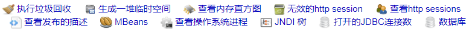

### 定时任务学习

---

### 一、配置环境

#### （1）持久化到数据库

```pom
  <!--quartz 定时调度-->
  <dependency>
      <groupId>org.springframework.boot</groupId>
      <artifactId>spring-boot-starter-quartz</artifactId>
      <version>2.2.0.RELEASE</version>
  </dependency>
```

- 数据表所在路径：` quartz-2.3.1.jar!\org\quartz\impl\jdbcjobstore\tables_mysql_innodb.sql` 
- 参考博客：[地址](https://www.cnblogs.com/deityjian/p/12512654.html) 
- [权限系统设计5张表](https://blog.csdn.net/weixin_43358075/article/details/93328560)   

### 二、quartz定时任务监控

- 在线预览地址：http://javamelody.org/demo/monitoring

- GitHub 仓库地址：https://github.com/javamelody/javamelody

- SpringBoot 整合javamelody 进行监控

  ```xml
   		<!--JavaMelody依赖-->
          <dependency>
              <groupId>net.bull.javamelody</groupId>
              <artifactId>javamelody-spring-boot-starter</artifactId>
              <version>1.86.0</version>
          </dependency>
  ```

- 预览地址：http://localhost:8091/monitoring 

- 监控信息

   

 